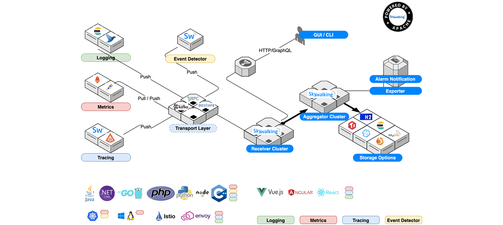
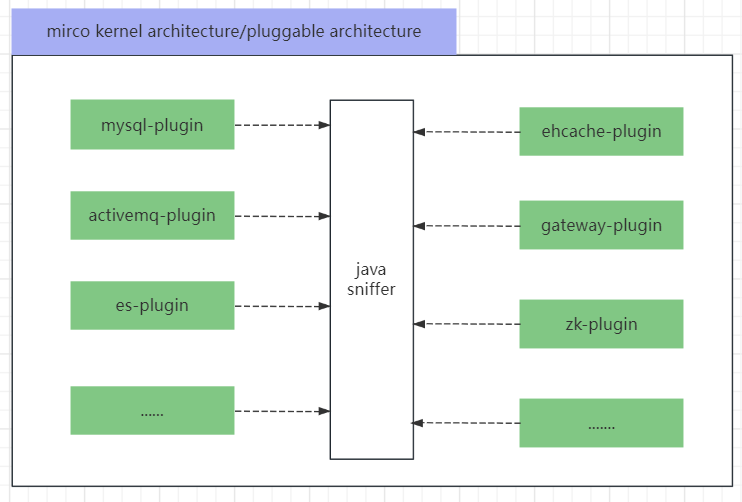

<h3 style="color:red;text-align:center">乐之者java: http://www.roadjava.com/ 制作</h3>

<h3 style="color:orange;text-align:center">bytebuddy进阶实战-skywalking agent可插拔式架构实现</h3>

前提课程:  https://www.bilibili.com/video/BV1G24y1a7bd/

### 一、目标工程创建

### 二、skywalking agent 可插拔式地加载插件演示

* skywalking 的组成 

  > Probes: agent项目（sniffer）
  >
  > Platform backend：oap
  >
  > Storage：oap使用的存储
  >
  > UI: 界面

  

* 微内核架构在skywalking中的应用

  

### 三、实现拦截springmvc的插件

### 四、实现拦截mysql的插件

### 五、可插拔式插件加载实现要点分析

* 怎么做到只指定一个-javaagent参数
* 怎么加载多个plugin？
* 怎么把typeDescription和要拦截的method对应起来
* 怎么把typeDescription和要拦截的method的拦截器对应起来

### 六、插件的抽象

### 七、插件的加载

### 八、skywalking agent 启动流程源码分析